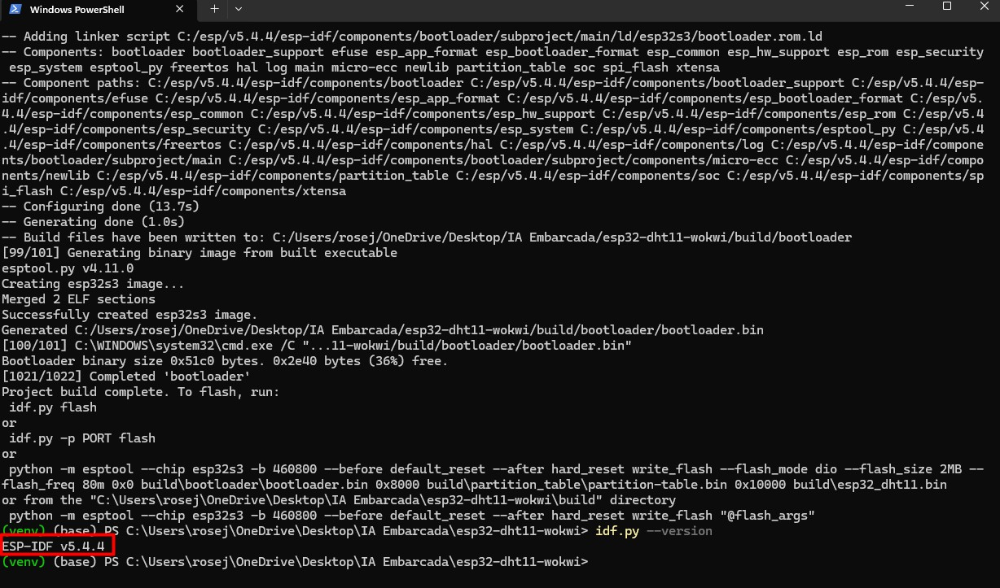
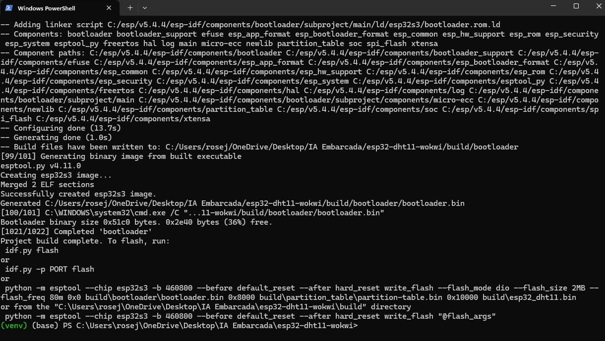
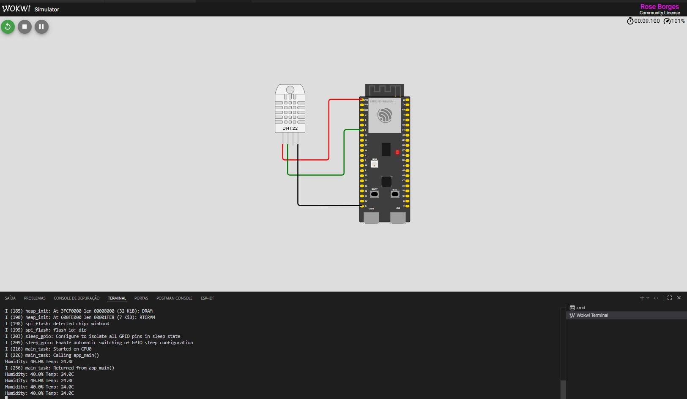

# ESP32-S3 + DHT22 — Leitura de Temperatura e Umidade

Projeto da disciplina de **IA Embarcada** (Pós-graduação) — leitura de temperatura e umidade com sensor **DHT22 (AM2301)** conectado ao **ESP32-S3**, simulado no **Wokwi** com o framework **ESP-IDF v5.4.4**.

## Circuito

| ESP32-S3   | DHT22 (AM2301) |
|------------|----------------|
| 3V3        | VCC            |
| GND        | GND            |
| **GPIO 7** | DATA (SDA)     |

> Pull-up interno do GPIO habilitado via `CONFIG_EXAMPLE_INTERNAL_PULLUP=y`.

## Como executar

1. Abrir o projeto no VS Code com a extensão **ESP-IDF** instalada
2. Definir o target: `ESP-IDF: Set Espressif Device Target` → `esp32s3`
3. Compilar: `idf.py build` (ou `ESP-IDF: Build your Project`)
4. Simular: `Ctrl+Shift+P` → `Wokwi: Start Simulator`

## Tecnologias e versões

- **ESP-IDF** v5.4.4
- **Toolchain** xtensa-esp-elf 14.2.0
- **Biblioteca DHT** `esp-idf-lib/dht ^1.2.0` (registry oficial)
- **Simulador** Wokwi (extensão VS Code)

## Resultado esperado

O monitor serial exibe leituras de temperatura e umidade a cada 2 segundos:

```
I (216) main_task: Started on CPU0
I (226) main_task: Calling app_main()
Humidity: 40.0% Temp: 24.0C
Humidity: 40.0% Temp: 24.0C
Humidity: 53.0% Temp: 35.5C
```

## Capturas de tela

### Versão do ESP-IDF instalada



### Build sem erros



### Aplicação rodando no Wokwi



## Estrutura do projeto

```
esp32-dht11-wokwi/
├── CMakeLists.txt
├── sdkconfig.defaults       # Configurações fixas (target, GPIO, console UART)
├── wokwi.toml               # Aponta firmware para o build do ESP-IDF
├── diagram.json             # Circuito do Wokwi (ESP32-S3 + DHT22)
├── README.md
└── main/
    ├── CMakeLists.txt
    ├── idf_component.yml    # Dependência do driver DHT
    ├── Kconfig.projbuild    # Opções do menuconfig
    └── main.c               # Código de leitura do sensor
```

## Autora

**Rose Borges** — Pós-graduação em IA Embarcada

**Rodrigo Kobashikawa Rosas** — Professor
